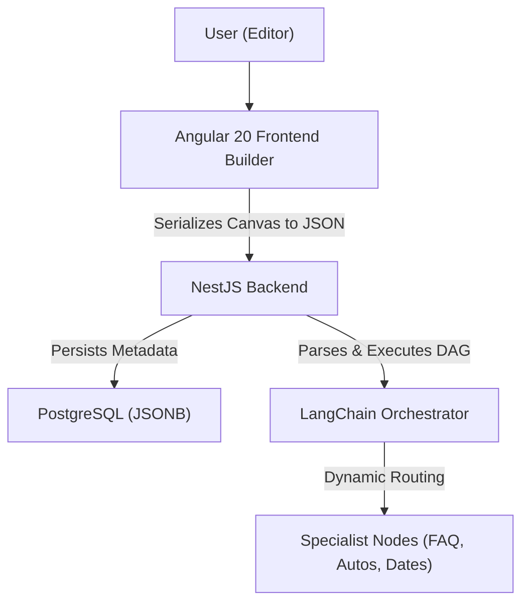

# System Architecture: Metadata-Driven DAG

This document describes the high-level architecture of the **AtomChallenge AI Agent Builder**, specifically focusing on the **Metadata-Driven DAG** core pattern.

## 1. High-Level Design: Metadata-Driven DAG

The system is built upon a **Metadata-Driven Directed Acyclic Graph (DAG)**. This means that the entire logical execution of an AI agent is not hardcoded but defined by a metadata structure (JSON) generated by the frontend.

### 📐 What is Metadata-Driven DAG?
- **Metadata:** All node configurations, connections, and logic are stored as a JSON object (`graph_json`) in the database.
- **DAG (Directed Acyclic Graph):** The flow represents a series of directed steps where execution moves forward without circular loops.
- **Execution:** The backend's execution engine parses this metadata at runtime to decide which node to execute next, how to process data, and where to route the final response.

## 2. Component Roles

### 2.1. Frontend (The Builder)
- Responsible for the visual representation of nodes and edges using `ngx-xyflow`.
- Manages the state of the canvas via **Angular Signals**.
- Validates that the graph is logical before allowing "Deploy".
- Provides a **Playground** chat interface for real-time testing.

### 2.2. Backend (The Orchestrator)
- Provides a RESTful API for managing agent flows (stored in PostgreSQL).
- Executes the logic of a flow by traversing the state machine (DAG) defined in the `graph_json`.
- Manages user sessions and chat history to maintain context.
- Integrates with OpenAI/LangChain for LLM-based reasoning (Orchestrator node).

### 2.3. PostgreSQL (The Memory)
- **`flows` Table:** Stores the graph metadata, status, version, and the `graph_json` blob.
- **`sessions` Table:** Stores chat history per unique `sessionId`.
- **`agents` Table:** Stores published versions of the flows with an assigned `agentUuid`.

## 3. Communication Patterns
- **REST:** All CRUD operations and management functions.
- **SSE/WebSockets (Planned):** Streaming "Trace" logs from the backend to the frontend's technical console.
- **Async Execution:** Heavy LLM logic is handled asynchronously using RxJS and LangChain chains.

## 4. Key Security & Scaling
- **API Keys:** Each published agent has a unique key for external integration.
- **Stateless Execution:** The backend execution engine is designed to be stateless, loading the graph on each request, which allows for horizontal scaling.
